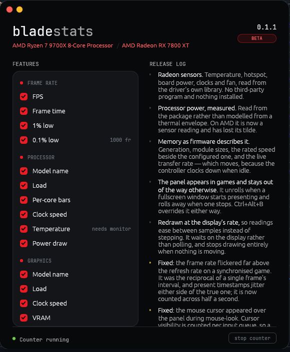

# bladestats

A hardware monitor and FPS overlay for Windows 10/11. One executable, no installer, no service,
no account.




## What it shows

**Frames** — FPS, frame time, 1% and 0.1% lows, the graphics API, the upscaler and frame
generation when a game has them loaded.

**Processor** — load and clock per core, package power, temperature.

**Graphics** — load, VRAM, temperature, hotspot, core and memory clocks, board power, fan speed.

**Memory** — used and total, generation and speed, module sizes, live transfer rate.

Anything that cannot be read is drawn as a dash rather than a zero.

## What it needs

- Windows 10 or 11.
- Administrator rights for the frame counter. Without them everything else still works and the
  frame rate shows a dash.
- The game in borderless windowed mode. Exclusive fullscreen cannot be drawn over, and the
  overlay hides itself there.
- An AMD or NVIDIA graphics card for temperature and power. Intel is not read yet.
- Processor temperature needs LibreHardwareMonitor. The settings window offers to fetch it.

## Building

```sh
cargo build --release
```

The font is not stored in the repository — see [assets/fonts/README.md](assets/fonts/README.md).

## Running

```sh
bladestats.exe                  # settings window plus the counter
bladestats.exe --counter        # the counter alone
bladestats.exe --counter --profile=cost.csv   # and log what it costs
```

`Ctrl+Alt+B` shows or hides the overlay. `Ctrl+Alt+R` re-reads the settings.

Settings live in `bladestats.toml` next to the executable and are applied about a second after
they change.

## Licence

Code is MIT, see [LICENSE](LICENSE).

JetBrains Mono is under the SIL Open Font License 1.1. Its text lives next to the font in
[assets/fonts/LICENSE-JetBrainsMono.txt](assets/fonts/LICENSE-JetBrainsMono.txt) and must
accompany any build that embeds it.
